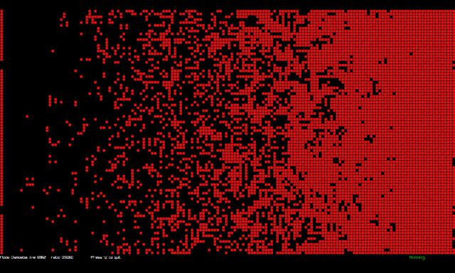
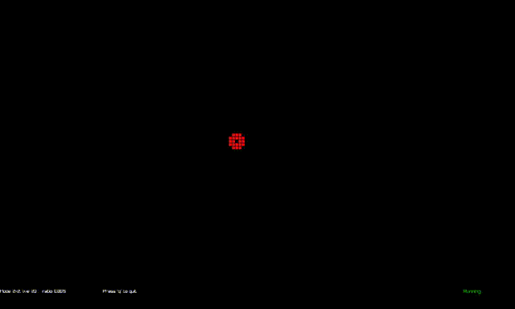
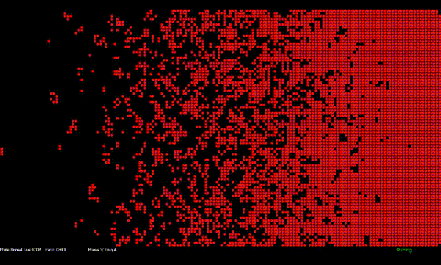

# Cellular Automata Visualizer (C++ · Raylib)

A flexible, high-performance cellular automata simulator written in modern C++ and rendered using **Raylib**.  
The project began as a personal implementation of **Conway’s Game of Life**, but has expanded into a fully interactive playground supporting multiple species of automata, color-aging, and real-time rule switching.

This visualizer is designed to be both **educational** and **mesmerizing**.

---

## Features

### ✔ Multiple Built-in Automata
Use **↑ / ↓** to browse modes and **Enter** to select:

- Conway’s Game of Life (`B3/S23`)  
- Replicator (`B1357/S1357`)  
- Seeds (`B2/S`)  
- B25/S4  
- Life Without Death (`B3/S012345678`)  
- 34 Life (`B34/S34`)  
- Diamoeba (`B35678/S5678`)  
- 2×2 (`B36/S125`)  
- HighLife (`B36/S23`)  
- Day & Night (`B3678/S34678`)  
- Morley (`B368/S245`)  
- Anneal (`B4678/S35678`)

Each mode swaps in a different **array of function pointers**, allowing each neighbour count (0–8) to map to an arbitrary transition rule.

---

## Color Aging System

Each live cell maintains an age counter. Every generation:

- If the cell survives, its age increments.
- Its displayed color cycles smoothly through the **360-entry RGB spectrum** stored in `rgb_table.cpp`.
- If the age exceeds 359, it clamps at the last color.

This produces visually striking organic patterns that highlight longevity, stability, and fractal growth.

Example of the color-draw helper (adapted):

    void draw_colour_rgb(size_t x, size_t y, int index) {
        int age = m_cell_ages[index];
        if (age >= 360) age = 359;

        Color col = {
            rgb_values[age][0],
            rgb_values[age][1],
            rgb_values[age][2],
            255
        };

        DrawRectangle(x + 2, y + 2, m_cell_size - 2, m_cell_size - 2, col);
    }

The main renderer calls this for any live cell:

    if (m_cell_values[m_cycle_turn][i]) {
        m_live_count++;
        draw_colour_rgb(x, y, i);
    }

---

## Media

The `/assets` folder includes demonstration GIFs generated from live runs:

- `conway.gif` — Conway’s Life
    

      
    

- `diamoeba.gif` — Diamoeba (`B35678/S5678`)  
    

      
    

- `day_and_night.gif` — Day & Night  
    

      
    

- `m2x2.gif` — 2×2 automaton  
    

      
    

- `anneal.gif` — Anneal
    

      
    

---

## Controls

### Simulation
| Key | Action |
|-----|--------|
| Space | Toggle running / paused |
| r | Start running |
| s | Stop (pause) |
| Shift + R | Enter random density selection (0–9) |
| g | Generate left-to-right density gradient |
| q | Quit |

### Mode Selection
| Key | Action |
|-----|--------|
| m | Enter mode-selection UI |
| ↑ / ↓ | Scroll automata list |
| Enter | Apply selected automaton |

### Mouse
| Button | Action |
|--------|--------|
| Left click | Turn a cell on |
| Right click | Turn a cell off |

---

## HUD and Debug Overlay

A single line at the bottom of the screen shows:

- Current automaton mode (string)  
- Live cell count  
- Live-density ratio (live / total)  
- Context-sensitive prompts (random density entry, mode select)

Example HUD text:

    Mode: DIAMOEBA, live: 15200    ratio: 0.0432      Press 'q' to quit

When in mode-select or random-entry state, the HUD displays an instruction line such as:

    MODE: Press up/down and enter 'HighLife'
    RANDOM: Enter digit (0~9)

---

## Technical Architecture

### Grid Representation
- Two boolean buffers (`m_cell_value_a`, `m_cell_value_b`) in ping-pong fashion (double-buffered).  
- A separate integer array `m_cell_ages` parallel to the grid that tracks age per cell for coloring.  

### Rule System via Function Pointers
Each automaton initializes:

    bool (*m_rule_array[9])(bool current_state);

Index `n` corresponds to `n` live neighbors. Each function transforms the old state into the new state (for example: `perish()`, `wake()`, `rest()`, `flip()`).

This design allows quick rule swapping with minimal branching.

### Rendering Loop
- Clear background  
- `world.cycle()` — compute next generation into off-buffer  
- `world.draw_cells()` — draw grid and live cells using `draw_colour_rgb()` for coloured cells  
- Draw HUD text

Rendering only compiles when `RAYLIB_ENABLED` is enabled.

---

## Build Instructions

### Requirements
- C++17 or later  
- Raylib (and system libraries such as `libm`, `dl`, `pthread`)  
- A C++ toolchain: `g++`, `clang++`, or MSVC

### Example (Linux)

    g++ main.cpp rgb_table.cpp -lraylib -lm -ldl -lpthread -std=c++17 -O3 -o automata

If your build uses separate `world.cpp`, `render.cpp`, etc., include them in the compile line or use a `CMakeLists.txt`.

---

## Adding a New Automaton

1. Implement or pick mapping semantics for neighbour counts 0..8 (birth/survive rules).  
2. Fill `m_rule_array[0..8]` with pointers to transition functions such as:
   - `perish(old) -> 0`
   - `wake(old) -> 1`
   - `rest(old) -> old`
   - `flip(old) -> 1 - old`
3. Add the mode constant (e.g., `_MYRULE`) and the `get_rules_myrule()` function.  
4. Wire `_MYRULE` into `select_game_mode()`.

---

## Future Extensions

- B/S rule parser (e.g., `"B35678/S5678"`) that auto-populates `m_rule_array`.  
- Save/load of grid states and animated exports.  
- GPU-accelerated or SIMD-optimized update path for very large grids.  
- Interactive rule editor to draw and immediately test custom rules.

---

## License

MIT — free for learning, modification, and presentation.

---

## Author Notes

This project grew out of an exercise in learning modern c++ and playing cellular automata. It evolved into a visual playground. The color-aging system reveals long-lived structure and makes different automata visually distinct.

